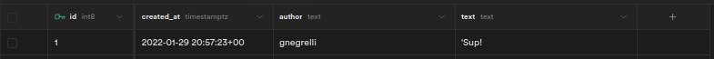
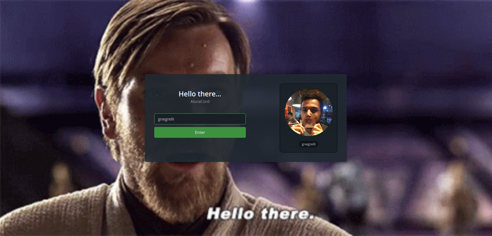
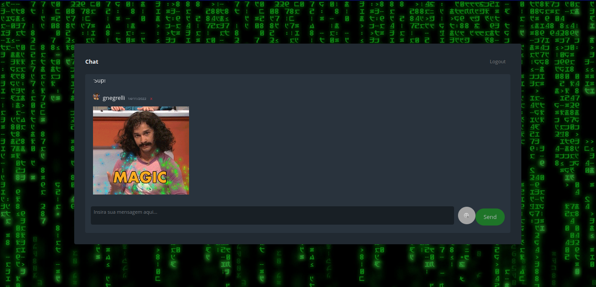
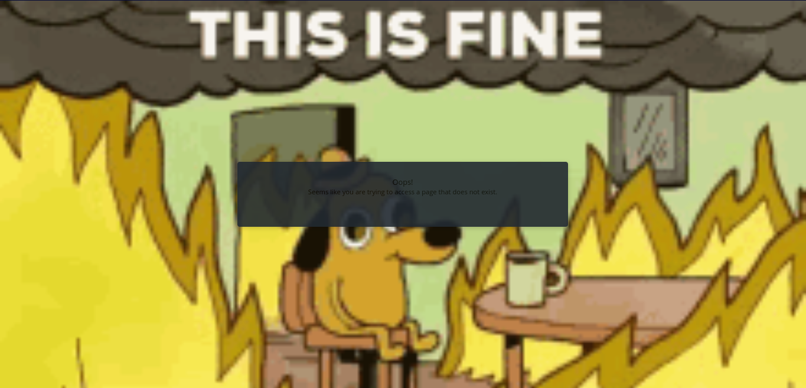

# React discord

This project creates a discord-like chat page using React and components from [SkynexUI](https://skynexui.dev/). This projects follows the steps shown in the React immersion course provided by [@alura](https://github.com/alura) and [@omariosouto](https://github.com/omariosouto).

## Installation

To install node packages required, simply run the following command on your terminal:

```commandline
$ npm install
```

After that, replace the environment variables listed in the `sample.env` file and rename the file to `.env`. This will allow Next to load them properly.

> NOTE: This project uses [supabase](https://supabase.com/) as database. If you want to use a different service for that, you will most likely have to replace the `.env` file entirely, as well as modifying some lines of code in `chat.js`.

## Supabase setup

Supabase is Backend-as-a-Service (BaaS) platform that allows users to easily create databases without any coding. With it, developers can create tables, authenticate users, store data and much more without less than no time.

For this project, a supabase project was created to hold the table containing the messages ours users sent to the chat server. This table stores the message's author and text alongside the moment the message was sent, as shown in the snippet below.



### Supabase API

In order to connect React applications to the database, Supabase provides client libraries that can access their API's. To use them, simply replace the values of the environment variables listed in `sample.env` with the ones provided in your project homepage. There you can also find libraries for other programming languages and examples on how to use them.

## Running the chat server

After [installing the required packages](#Installation) and [setting up the backend](#Supabase-setup), you can now run the discord-esque chat server. To do so, execute the command below.

```commandline
$ npm run react  # Builds the application
$ npm run start  # Launches application
```

Then, go to `https://localhost:3000` to access the applcation in its full glory!!

## Pages

Currently, this application contains 3 pages that users can go to.

### Login page

The landing page of this application is a login page for users to type in their github username and log into the server. As users type in their usernames in the text field, the application fetches the user's profile image from github. The image below depicts the landing page. 



> NOTE: In this project there is no authentication whatsoever. Thus, anyone can sign in with any user they want to.

### Server page

After logging in, user are shown the chat are. There all messages from different users are displayed. They can also send messages (and even stickers!) using the text area below the chat box.



### 404 page

In case users try to access a page that does not exist, they will be taken to a custom error page, as show below.

