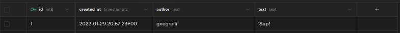

# React discord

This project creates a discord-like chat page using React and components from [SkynexUI](https://skynexui.dev/). This projects follows the steps shown in the React immersion course provided by [@alura](https://github.com/alura) and [@omariosouto](https://github.com/omariosouto).

## Installation

To install node packages required, simply run the following command on your terminal:

```commandline
$ npm install
```

After that, replace the environment variables listed in the `sample.env` file and rename the file to `.env`. This will allow Next to load them properly.

> NOTE: This project uses [supabase](https://supabase.com/) as database. If you want to use a different service for that, you will most likely have to replace the `.env` file entirely, as well as modifying some lines of code in `chat.js`.

## Supabase setup

Supabase is Backend-as-a-Service (BaaS) platform that allows users to easily create databases without any coding. With it, developers can create tables, authenticate users, store data and much more without less than no time.

For this project, a supabase project was created to hold the table containing the messages ours users sent to the chat server. This table stores the message's author and text alongside the moment the message was sent, as shown in the snippet below.



